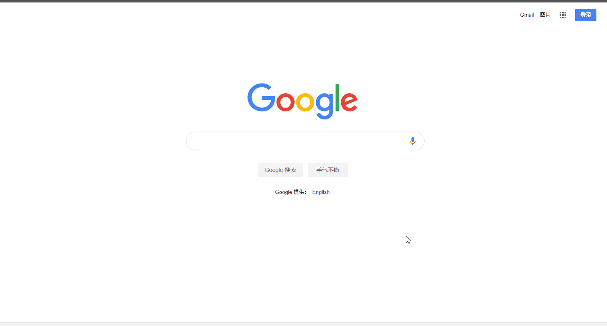
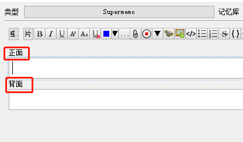

## Anki Search On The Web Page
## 在网页上同步搜索本地的的Anki数据

---
### 效果展示


### 安装
#### 1、安装AnkiConnect插件
在本地Anki软件上安装[AnkiConnect插件](https://ankiweb.net/shared/info/2055492159)，（安装code：2055492159）
安装完成后，重启anki。
注：anki在启动状态下才能使用本脚本

#### 2、浏览器安装Tampermonkey
[anki_search_on_web](https://github.com/yekingyan/anki_search_on_web/blob/master/anki_serarch.js)是油猴脚本，添加完刷新一下，就可以用了


如何使用 Tampermonkey?
[用 Chrome 的人都需要知道的「神器」扩展：「油猴」使用详解](https://sspai.com/post/40485)

#### 3、配置
##### 3.1 卡片类型
如果你是中文的Supermemo类型，则不用设置，否则搜索结果无法显示。

如果你的卡片类型字段不是"正面"、"反面"，请在脚本中修改
```js
// 卡页类型，正反面的名称
// 默认supermemo不用设置
// 目前只持支取两个字段
const FRONT_CARCD_FILES = '' // 填入正面对应的字段
const BACK_CARK_FILES = ''   // 填入背面对应的字段
```
 比如
```js
const FRONT_CARCD_FILES = 'Front'
const BACK_CARK_FILES = 'Back' 
```

##### 3.2 搜索范围
默认搜索全部（排除了'English'牌组）
你可以在脚本中自定义修改，规则与客户端搜索一样

```js
// 搜索范围设置
// 只搜English牌组，'deck:English'
// 排除English牌组，'-deck:English'
const SEARCH_FROM = ''
```

比如
```js
const SEARCH_FROM = 'deck:MyDecks'
```